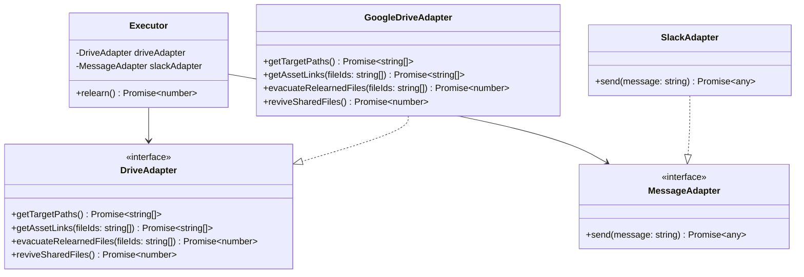

# relearn
This system reminds us of our favorite screenshots in Google Drive every day. It picks image files up from Google Drive and notifies the shared links to your Slack channel.

## Architecture

## Motivation
When I find some good tweets or posts etc.. I take a screenshot and upload it to my Google Drive, but I never check it again...

This system reminds us of the screenshots randomly every day, and we can relearn them.

## How it works
1. The system picks random image files from your specified Google Drive folder
2. Generates shared links for the selected files
3. Sends the links to your Slack channel
4. Moves the shared files to a temporary folder to avoid duplicate notifications
5. When there are no more files to share, it revives all files from the temporary folder for the next cycle

## Set up
- Create your Google Cloud project and enable Google Drive API
  - Create a service account and download the credentials JSON file
  - Share your target Google Drive folder with the service account email
  - Get your folder ID from the folder URL
- Create your Slack app from [the slack api page](https://api.slack.com/apps)
  - Get your webhook url
- Please fork this repository and set required environment variables in the Actions secrets
  - See `.env.template`
  - `GOOGLE_DRIVE_CREDENTIALS`: JSON string of your service account credentials
  - `GOOGLE_DRIVE_FOLDER_ID`: Your target Google Drive folder ID
  - `SLACK_WEBHOOK_URL`: Your Slack webhook URL

## Development
- Develop
  - `npm run dev`
- Watch code changes
  - `npm run dev:watch`
- Lint
  - `npm run lint`
- Format
  - `npm run format`
